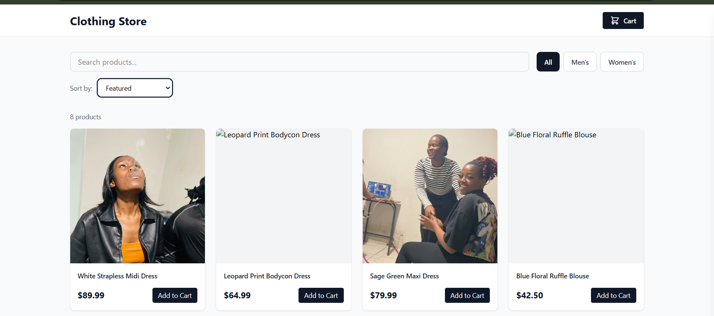
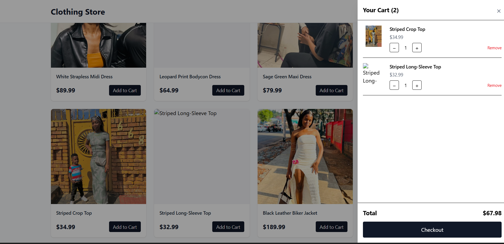
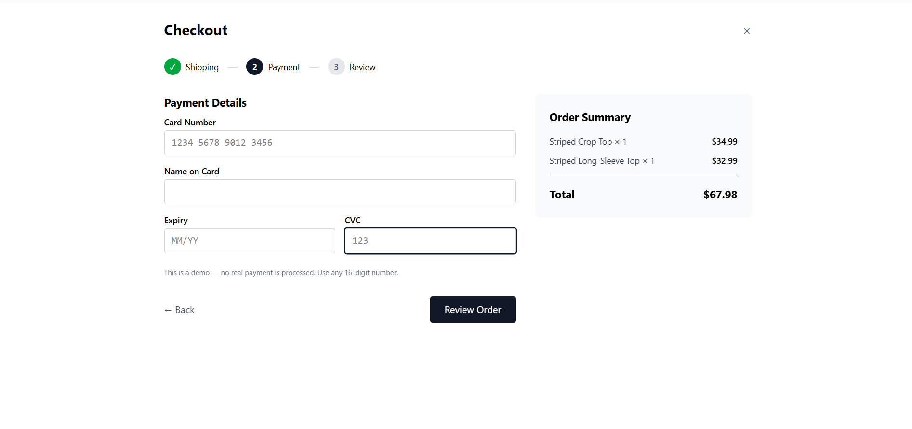

# Clothing Store

A responsive e-commerce storefront built with React, TypeScript, and Tailwind CSS.

** Live Demo:** https://clothing-store-xi-gray.vercel.app

## Screenshots

### Product Grid



### Shopping Cart



### Checkout



## Features

-  Product grid with responsive layout (mobile → desktop)
-  Search, category filter, and sort by price/name
-  Product detail pages with dynamic routing
-  Shopping cart with add, remove, and quantity controls
-  Cart persists across page refreshes via localStorage
-  Multi-step checkout with form validation
-  Loading skeletons and error handling
-  Styled with Tailwind CSS v4
-  Fully responsive design

## Tech Stack

- **React 19** + **TypeScript**
- **Vite** for build tooling
- **Tailwind CSS v4** for styling
- **React Router** for client-side routing
- **React Context** for cart state management
- **localStorage** for persistence
- **Vercel** for deployment

## Getting Started

```bash
npm install
npm run dev
```

Open [http://localhost:5173](http://localhost:5173) in your browser.

## Project Structure

```
src/
├── components/       # Reusable UI (ProductCard, CartDrawer, FilterBar, etc.)
├── context/          # CartContext with localStorage persistence
├── pages/            # Route pages (Home, ProductDetail)
├── types/            # TypeScript type definitions
├── App.tsx           # Router + layout
└── main.tsx          # Entry point
```

## Roadmap

- [x] Product grid with custom photography
- [x] Search, category filter, and sort
- [x] Product detail pages with routing
- [x] Shopping cart with localStorage
- [x] Multi-step checkout with validation
- [ ] User authentication
- [ ] Real payment integration (Stripe)